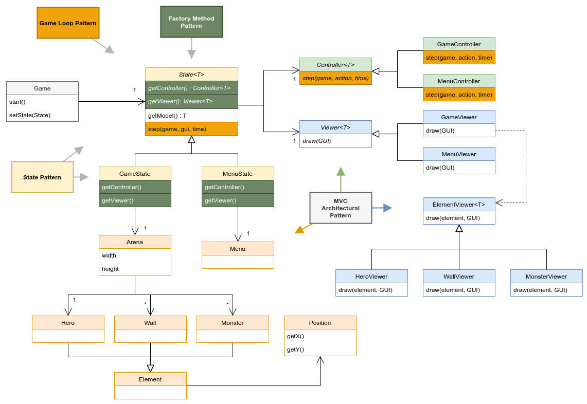
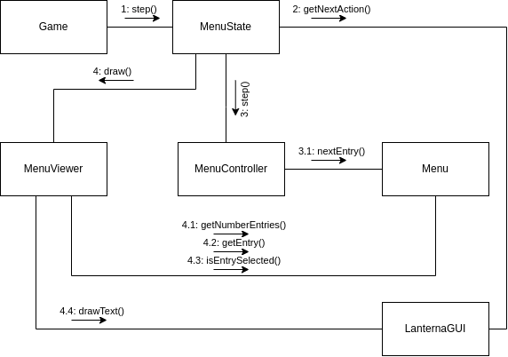
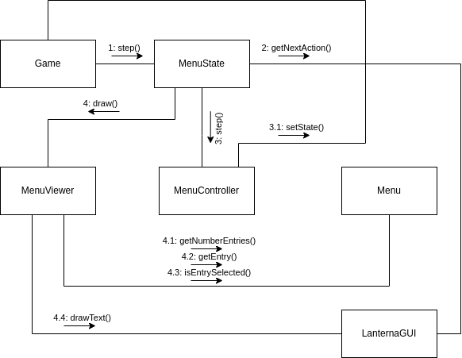
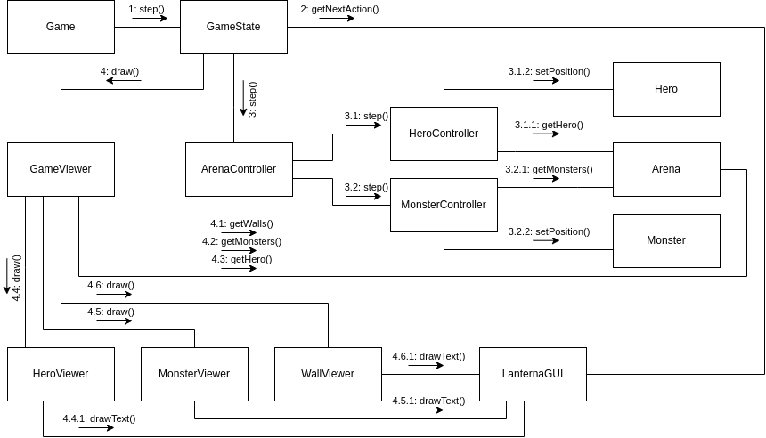

# A Solid Hero

The LDTS Hero project done using SOLID principles and Design Patterns

## UML Class Diagram

A UML class diagram showcasing used Design Patterns:

## UML Communication Diagrams

A UML communication diagram showing how classes communicate during a game step when the menu state is active:

A UML communication diagram showing how classes communicate during a game step when the menu state and the user selects an option:

A UML communication diagram showing how classes communicate during a game step when the game state is active:

